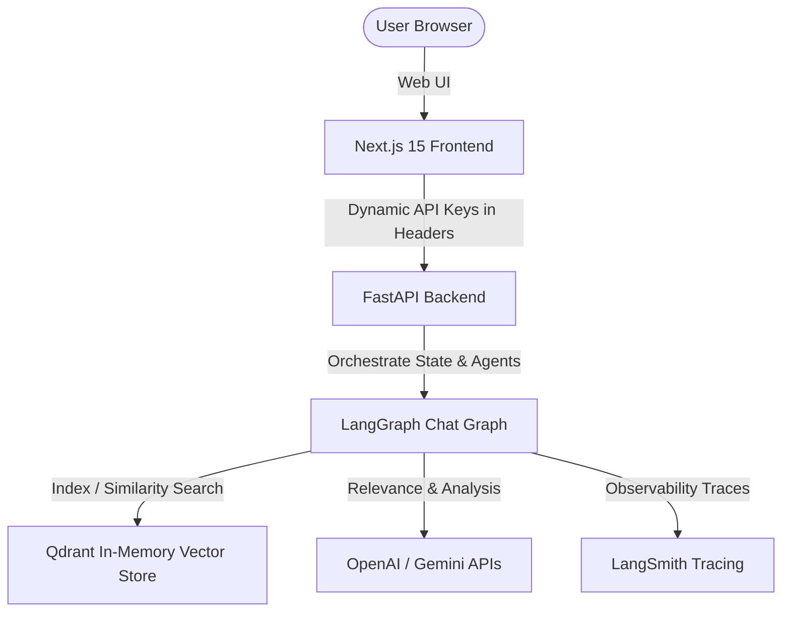

# arXivAgent - Research Intelligence Platform

`arXivAgent` is an agentic AI research platform designed to automate the discovery, ingestion, synthesis, comparison, and analysis of scientific literature from arXiv.

The platform demonstrates production-ready Agentic AI engineering patterns, integrating decoupled backend reasoning agents compiled using **LangGraph** with a responsive **Next.js** frontend. It features in-memory semantic vector retrieval powered by **Qdrant**, citation-grounded answer verification, and automated LLM-as-a-judge evaluation pipelines, all securely executed using dynamic, client-side API credentials.

---

## 🏗️ System Architecture

The application is structured as a decoupled Next.js web application and a FastAPI backend:



### 🧠 Agentic Workflows

1. **Research Discovery Agent**: Evaluates title and abstract relevance to search queries in real-time. If the arXiv API is offline or rate-limiting, the agent triggers an **LLM Mock Paper Fallback** to generate highly realistic, query-relevant papers dynamically.
2. **Analysis Agent**: Extracts core methodologies, mathematical claims, and research gaps to build a concise metadata digest.
3. **Citation Verification Agent**: Validates that all RAG chat assertions are grounded in ingested text, highlighting exact source sentences.
4. **Comparison Agent**: Analyzes key differences, overlaps, and research gaps across multiple selected papers.
5. **Evaluation Agent**: Implements automated LLM-as-a-judge metrics (Faithfulness, Relevance, Recall) to assess retrieval and generation quality.

---

## 🌟 Core Features

- **Natural Language arXiv Search**: Supports standard search query syntax (quotes, boolean operators `AND`, `OR`, `ANDNOT`).
- **Live Agent Terminal Console**: Streams the inner thoughts, tool calls, and relevance evaluations of the Discovery Agent line-by-line using Server-Sent Events (SSE).
- **Search Pagination**: Incremental page-offset pagination loading exactly 15 papers per batch.
- **Visual Vector Inspector**: Renders chunks and cosine similarity scores for search transparency.
- **Observability Dashboard**: Displays step-by-step latencies, token usage, and cost estimates.
- **Dynamic Security**: Client API keys (`OpenAI`, `Gemini`, `LangSmith`) are entered via a Gear icon modal, saved in browser `localStorage`, and sent only via HTTPS headers. **No keys are stored on the server.**

---

## 📁 Directory Structure

```text
arXivAgent/
├── backend/                  # FastAPI Application
│   ├── agents/               # Specialized AI Agent Modules
│   │   ├── discovery.py      # Search, LLM Mock paper generator, Discovery Agent
│   │   ├── analysis.py       # Extract text, chunking, analysis agent
│   │   ├── verification.py   # Grounding & citation highlighting agent
│   │   ├── comparison.py     # Cross-paper matrix agent
│   │   └── graph.py          # LangGraph Chat Compiler & state chart
│   ├── db/                   # Workspace and local JSON state stores
│   ├── main.py               # API routes (SSE Search, Ingest, Chat, Compare)
│   └── requirements.txt      # Python dependencies
├── frontend/                 # Next.js 15 App
│   ├── src/
│   │   ├── app/              # Routing, layout, and global styles
│   │   ├── components/       # Search, Chat, Sidebars, and observabilities
│   │   │   ├── ArxivSearch.tsx  # Discovery panel with SSE stream console
│   │   │   ├── PaperChat.tsx    # RAG chat & citations UI
│   │   │   └── ...
│   └── package.json          # Node dependencies
└── README.md                 # Project documentation
```

---

## 🚀 Getting Started

### Prerequisites

Make sure you have the following installed:

- **Python 3.10** or higher
- **Node.js 18** or higher
- **npm** (Node Package Manager)

---

### Step 1: Set up the Backend (FastAPI)

1. Open your terminal and navigate to the `backend` folder:

   ```bash
   cd backend
   ```

2. Create a virtual environment:

   ```bash
   python3 -m venv venv
   ```

3. Activate the virtual environment:
   - **Mac/Linux**:
     ```bash
     source venv/bin/activate
     ```
   - **Windows**:
     ```bash
     venv\Scripts\activate
     ```

4. Install the backend dependencies:

   ```bash
   pip install -r requirements.txt
   ```

5. Launch the FastAPI server:
   ```bash
   python main.py
   ```
   _The server will start running at `http://127.0.0.1:8000`._

---

### Step 2: Set up the Frontend (Next.js)

1. Open a new terminal window and navigate to the `frontend` folder:

   ```bash
   cd frontend
   ```

2. Install the frontend dependencies:

   ```bash
   npm install
   ```

3. Launch the development server:
   ```bash
   npm run dev
   ```
   _The client dashboard will start running at `http://localhost:3000`._

---

## 🛠️ Verification & Run Instructions

1. Open `http://localhost:3000` in your web browser.
2. Click the **Gear Icon** in the top right header to open the Settings Modal.
3. Input your **OpenAI API Key** and/or **Gemini API Key**. Optionally, add your **LangSmith API Key** for observability traces. Click **Save Configuration**.
4. Create a workspace in the left sidebar (e.g. "AI Research").
5. In the **Search arXiv** tab, enter a search term (e.g. `RAG evaluation`).
6. Observe the **Discovery Agent Console** stream the live thoughts and evaluations as the agent reviews papers.
7. Click **Ingest to Workspace** on any paper to index it into the vector database.
8. Switch to the **Paper Chat** tab to query your workspace papers, inspect retrieval chunks, or run paper-to-paper matrices in the **Compare Matrix** tab!

---

## 🛡️ License

Distributed under the MIT License. See [LICENSE](LICENSE) for more information.
